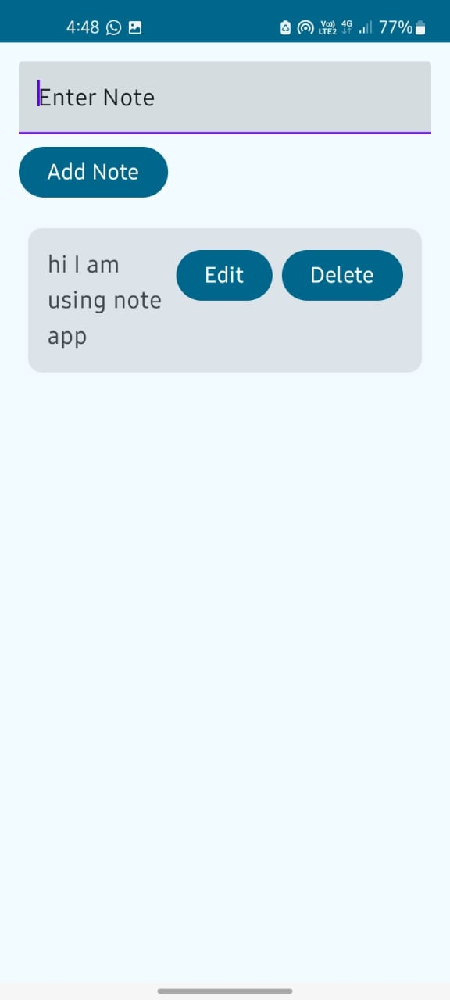
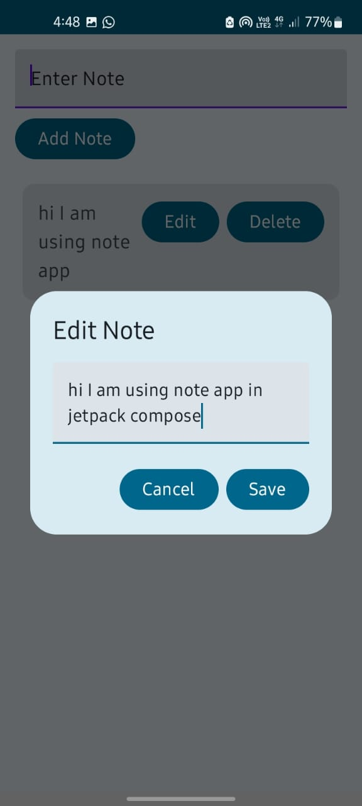

# MyCrudComposeApp
A simple **CRUD (Create, Read, Update, Delete)** note-taking app built with **Jetpack Compose** in Android.

## 📱 Features

- ✍️ Add notes
- 🗑️ Delete notes
- 🛠️ Edit/update existing notes
- 🔄 Real-time UI updates using Compose state management

## 🧰 Tech Stack

- [Kotlin]
- [Jetpack Compose]
- [Material3]
- State management with `remember` and `mutableStateOf`

## 📸 Screenshots

 

### Prerequisites
- Android Studio Hedgehog or later
- Kotlin 1.9+
- Gradle 8+

